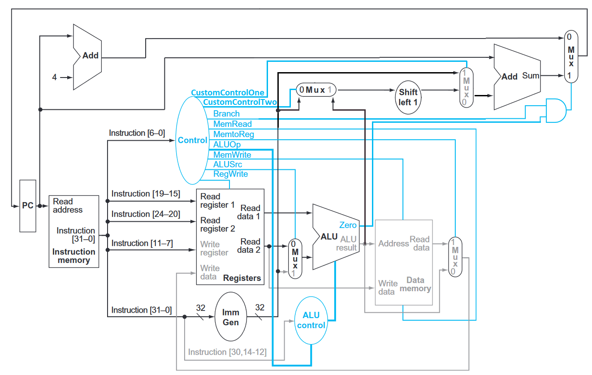

This is a Single Cycle RISC-V RV32I Core

All RV32I instructions except "FENCE", "ECALL" and "EBREAK" are supported.

This is original work that made for TUTEL Assignment 8.

It's my first Core design ever. There are bugs. It will be improved.

